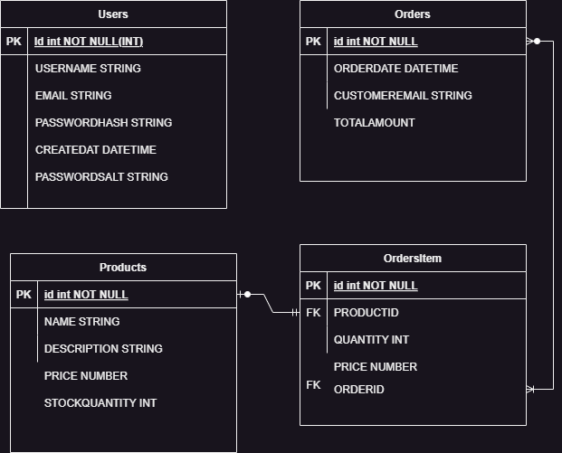

# E-commerce Backend API

Este proyecto es una API RESTful para un sistema de e-commerce, construido con .NET 8. Proporciona endpoints para la gestión de productos, órdenes y autenticación de usuarios.

)


## Características

- Autenticación de usuarios con JWT
- CRUD de productos
- Gestión de órdenes
- Arquitectura en capas (API, Core, Infrastructure)
- Uso de Entity Framework Core para el acceso a datos
- Swagger UI para documentación de la API

## Requisitos previos

- .NET 8 SDK
- SQL Server (local o en la nube)
- Visual Studio 2022 o Visual Studio Code

## Configuración

1. Clonar el repositorio:
   ```
   git clone https://github.com/jonatanmedina12/Project-App-Net-Ecommerce.git
   cd Project-App-Net-Ecommerce/Api
   ```

2. Configurar la cadena de conexión:
   - Abrir `Api/appsettings.json`
   - Modificar la cadena de conexión `DefaultConnection` con los detalles de tu base de datos SQL Server

3. Configurar JWT:
   - En `Api/appsettings.json`, actualizar la sección `Jwt` con tus propios valores:
     ```json
     "Jwt": {
       "Key": "TuClaveSecretaAquí",
       "Issuer": "TuIssuer",
       "Audience": "TuAudience"
     }
     ```
4. Configurar correo
   -Abrir `Api/appsettings.json`
   - Modificar la cadena de conexión
   ```json
     "AppName": "E-ecommers",
   "EmailSettings": {
     "FromAddress": "@outlook.com",
     "SmtpHost": "smtp-mail.outlook.com",
     "SmtpPort": 587,
     "EnableSsl": true,
     "Username": "@outlook.com",
     "Password": "_I"
   },
   ```
## Instalación

1. Restaurar los paquetes NuGet:
   ```
   dotnet restore
   ```

2. Aplicar las migraciones para crear la base de datos:
   ```
   cd Infrastructure
   dotnet ef migrations add InitialMigration

   dotnet ef database update
   ```

## Ejecución

1. Ejecutar la aplicación:
   ```
   dotnet run --project Api
   ```

2. La API estará disponible en `https://localhost:5001` (o el puerto que hayas configurado)

3. Acceder a Swagger UI para probar los endpoints:
   `https://localhost:5001/swagger`

## Estructura del proyecto

- `Api`: Proyecto de ASP.NET Core Web API
- `Core`: Contiene entidades, interfaces y servicios de dominio
- `Infrastructure`: Implementaciones de repositorios y contexto de base de datos

## Endpoints principales

- `POST /api/auth/register`: Registrar un nuevo usuario
- `POST /api/auth/login`: Iniciar sesión y obtener token JWT
- `GET /api/products`: Obtener todos los productos
- `POST /api/products`: Crear un nuevo producto
- `GET /api/orders`: Obtener todas las órdenes
- `POST /api/orders`: Crear una nueva orden

Para más detalles, consulta la documentación de Swagger UI.

## Pruebas

Para ejecutar las pruebas unitarias:

```
dotnet test
```

## Integración Continua y Despliegue Continuo (CI/CD)

Este proyecto utiliza GitHub Actions para implementar un pipeline de CI/CD. El pipeline está configurado para construir, probar y desplegar automáticamente la aplicación cuando se realizan cambios en el repositorio.

### Configuración del Workflow

El archivo de configuración del workflow se encuentra en `.github/workflows/backend-ci-cd.yml`. Este workflow se activa en los siguientes eventos:

- Push a la rama `main`
- Pull requests hacia la rama `main`

### Pasos del Pipeline

1. **Construcción (Build)**
   - Configura el entorno .NET
   - Restaura las dependencias del proyecto
   - Compila el proyecto
   - Ejecuta las pruebas unitarias
   - Publica la aplicación

2. **Despliegue (Deploy)**
   - Se ejecuta solo para pushes a la rama `main`
   - Descarga el artefacto construido
   - Simula un despliegue a un entorno de staging (esto debe ser personalizado según tus necesidades de despliegue)

3. **Control de Versiones**
   - Crea una nueva release en GitHub con cada push exitoso a `main`
   - Utiliza el número de ejecución del workflow como número de versión

## Licencia

Distribuido bajo la licencia MIT. Ver `LICENSE` para más información.

## Contacto

Jonatan Albenio Medina - JonatanAlbenioMedina@outlook.com 

Link del proyecto:https://github.com/jonatanmedina12/Project-App-Net-Ecommerce.git